<div align="center">
  
  
  
  
  
  <h1>NexaHome</h1>
  <p><strong>Comfort • Style • You</strong></p>
  <p>Experience smarter living with an intelligent, multi-platform smart home ecosystem.</p>
</div>

---

## 🌟 Welcome to the Future of Living

**NexaHome** isn't just an app—it's a complete paradigm shift for your everyday living. Imagine a home that knows what you need before you even ask. By seamlessly blending cutting-edge **React Native** mobility, a lightning-fast **NestJS** backend, and ultra-responsive **ESP32 IoT hardware**, NexaHome transforms any ordinary house into a state-of-the-art smart ecosystem. 

Whether you're protecting your family from hazards, optimizing your energy usage, or simply creating the perfect ambiance, NexaHome puts absolute control right at your fingertips.

---

## 🔥 Why Choose NexaHome?

🚀 **Intelligent AI Insights**  
Stop guessing and start knowing. NexaHome's AI engine analyzes real-time sensor data to give you personalized, actionable recommendations. From shutting windows before a storm hits to optimizing room lighting, the AI acts as your personal home concierge.

🛡️ **Real-Time Sensor Command Center**  
Experience unparalleled peace of mind. Monitor every corner of your house with instantaneous live feeds from **Light, Rain, Water, Gas, and Fire** sensors. If anything goes wrong, you are the first to know.

🏡 **Seamless Multi-Home Sync**  
Managing multiple properties? Easy. Create new homes, invite family members via a sleek 6-character Invite Code, and switch between your "Living Room" and your "Weekend Villa" with zero lag.

✨ **Breathtaking UI/UX Design**  
Who said utility can't be gorgeous? NexaHome features a premium, modern, and dark-mode compatible interface that feels incredibly smooth, intuitive, and satisfying to use every single day.

🔒 **Enterprise-Grade Security**  
Your data is yours. With robust NestJS authentication and secure API endpoints, your home's privacy is locked down tighter than a vault.

---

## 📸 Screenshots

<div align="center">
  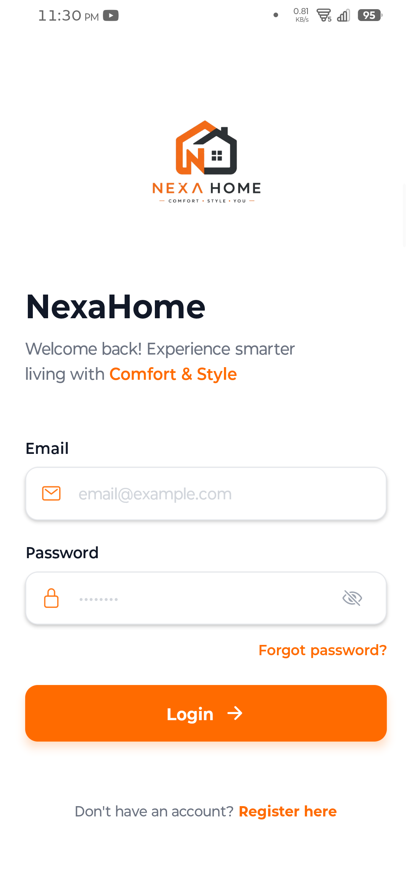
  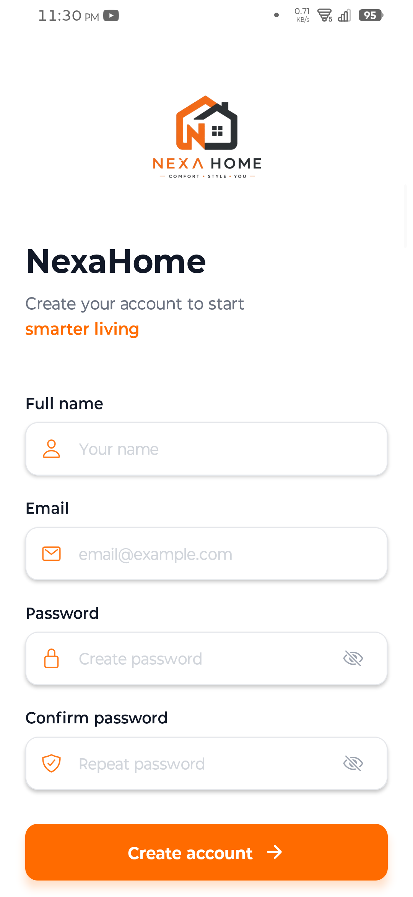
  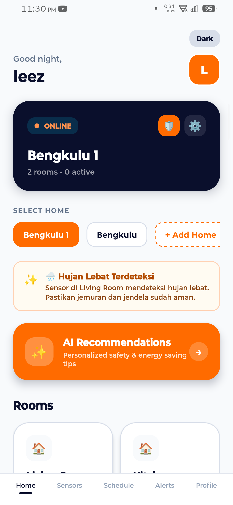
  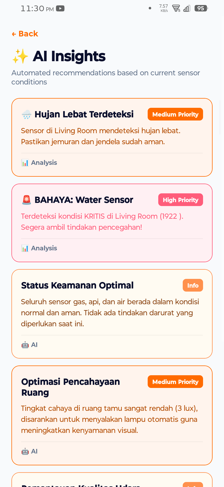
  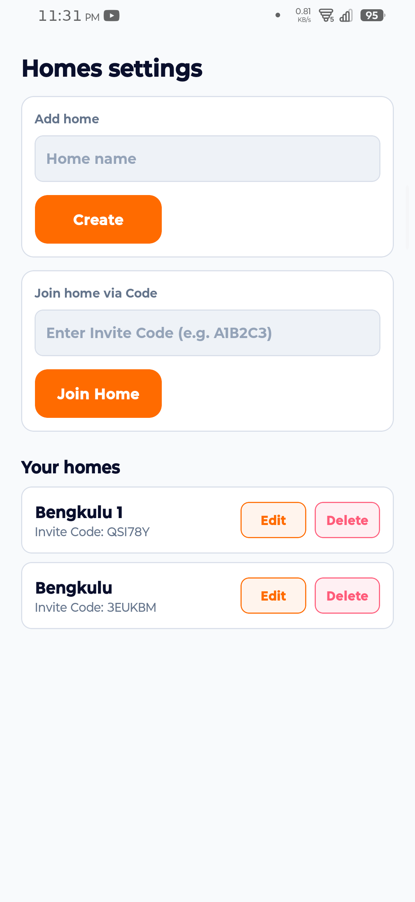
  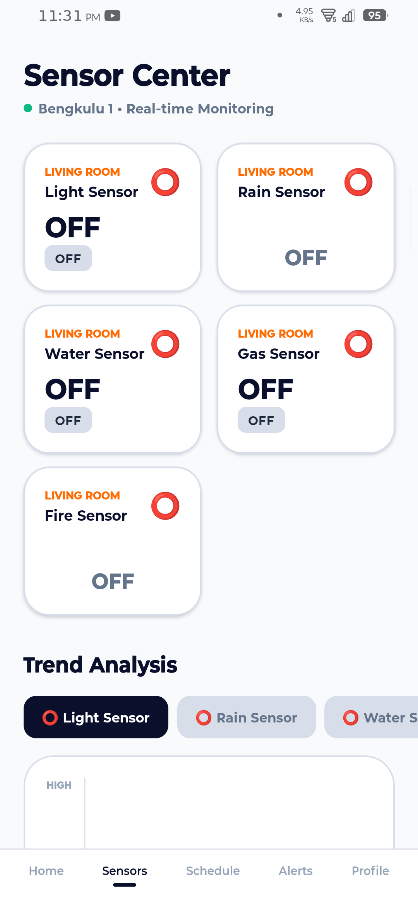
  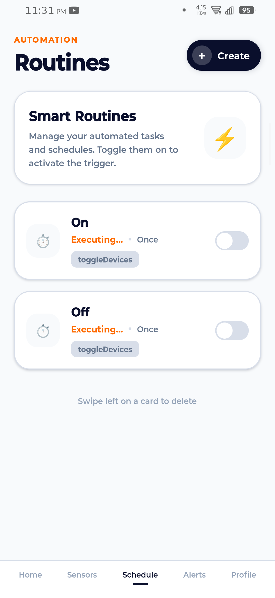
  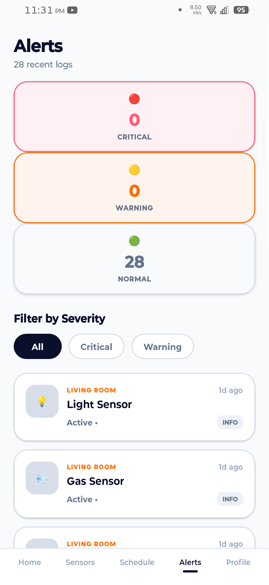
  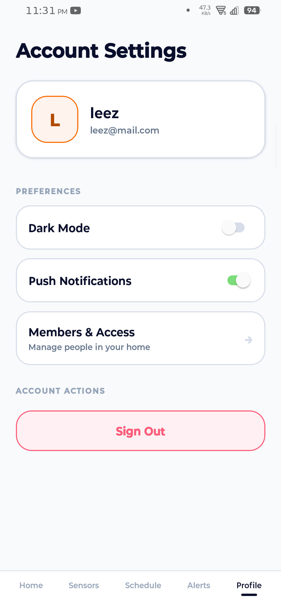
  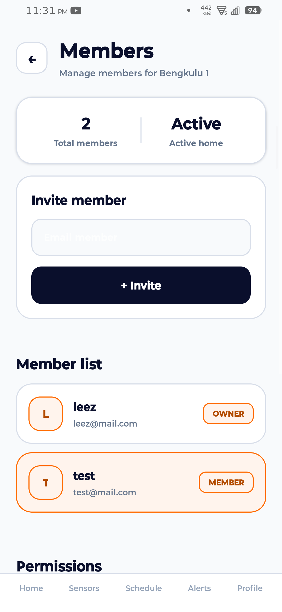
  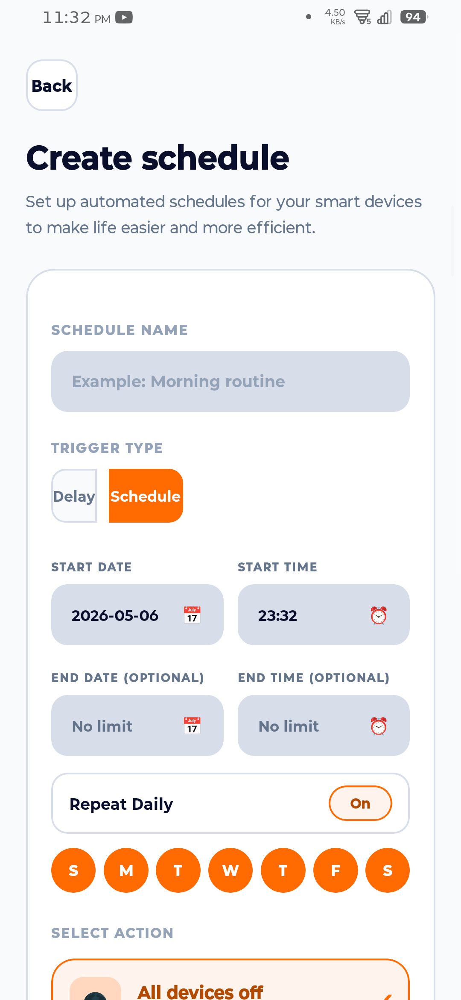
  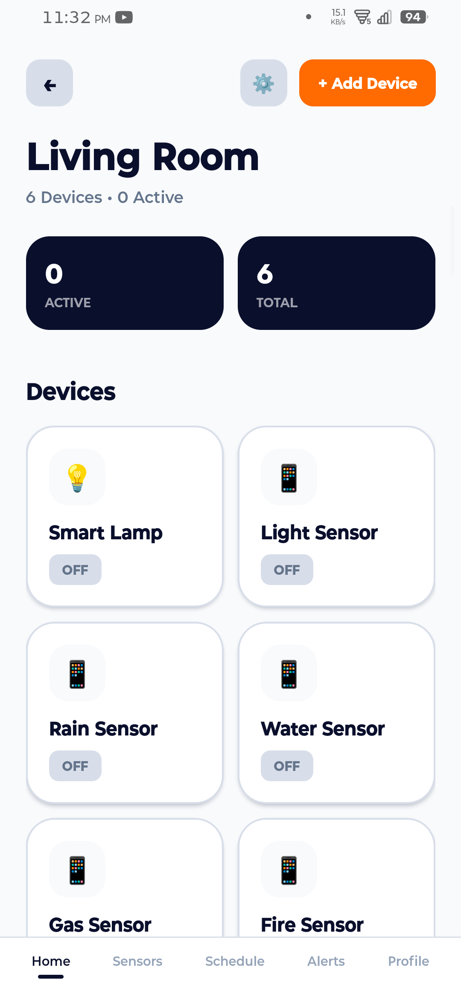
  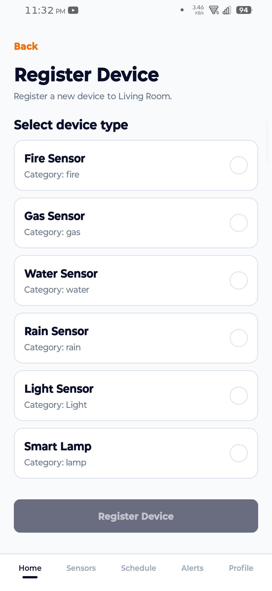
  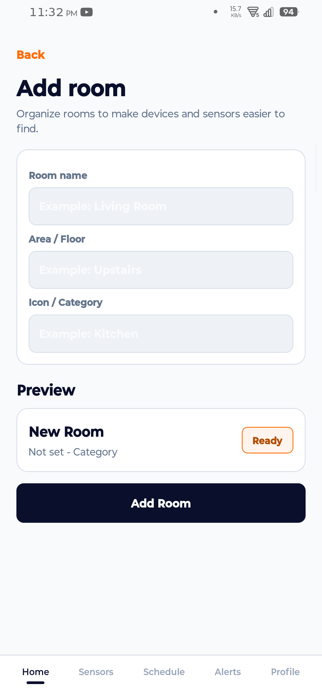
  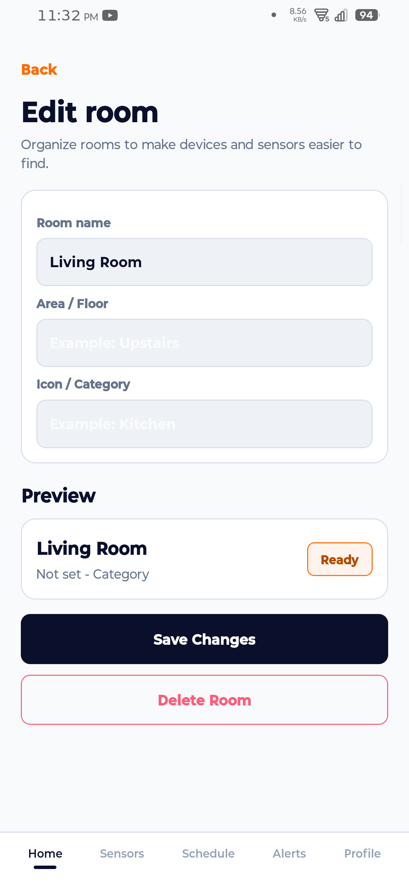
</div>

---

## 🏗️ Architecture & Tech Stack

NexaHome is structured as a monorepo containing three main components:

### 1. Mobile App (`/app`)
- **Framework**: React Native & Expo
- **Styling**: Custom modern UI with consistent theming
- **Features**: Cross-platform (iOS/Android), real-time updates

### 2. Backend Server (`/server`)
- **Framework**: NestJS (TypeScript)
- **Database**: MongoDB (via Mongoloquent / Mongoose)
- **Features**: RESTful API, Authentication, AI logic processing

### 3. Hardware / Firmware (`/firmware`)
- **Microcontroller**: ESP32
- **Language**: C++ (Arduino IDE)
- **Sensors**: LDR (Light), Rain Sensor, Water Level, MQ Gas Sensor, Flame/Fire Sensor
- **Platform**: IoT communication (e.g., Antares / MQTT)

---

## 🚀 Getting Started

### Prerequisites
- [Node.js](https://nodejs.org/) (v18+)
- [Expo CLI](https://docs.expo.dev/)
- [MongoDB](https://www.mongodb.com/) (Atlas or Local)
- [Arduino IDE](https://www.arduino.cc/en/software) (for hardware setup)

### 1. Clone the Repository
```bash
git clone https://github.com/username/nexahome-app.git
cd nexahome-app
```

### 2. Setup the Backend Server
```bash
cd server
npm install
```
- Create a `.env` file in the `server` directory and configure your MongoDB URI and JWT secrets.
- Run the server:
```bash
npm run start:dev
```

### 3. Setup the Mobile App
Open a new terminal window:
```bash
cd app
npm install
```
- Create a `.env` file in the `app` directory with your API endpoints.
- Start the Expo development server:
```bash
npx expo start
```
Scan the QR code with the **Expo Go** app on your physical device, or press `a` to run on an Android emulator.

### 4. Hardware Setup
- Open `firmware/firmware.ino` using the Arduino IDE.
- Update your Wi-Fi credentials and IoT platform keys in the code.
- Flash the code to your ESP32 board.

---

## 🤝 Contributing

Contributions, issues, and feature requests are welcome! Feel free to check the [issues page](#).

## 📄 License

This project is licensed under the MIT License - see the LICENSE file for details.
